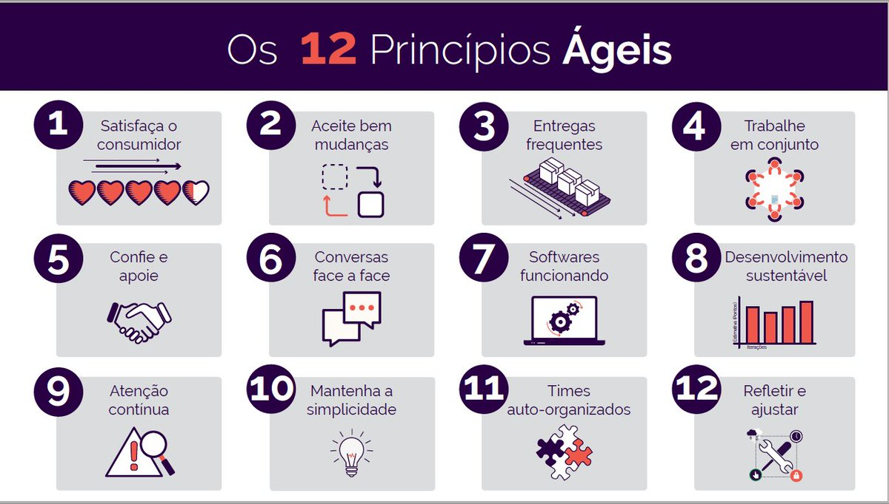

# SCRUM - Agile Metodologies

### Atual Ambiente

* Volatility
* Uncertainty
* Complexity
* Ambiguity

### Termos mudando

##### Old    ==>  New

Lucro        ==>  Proposito

Comando      ==>  Liderança distribuída

Chefe        ==>  Facilitador

Regras       ==>  Liberdade e Confiança

Planejamento ==>  Experimentação

Erro         ==>  Aprendizado Contínuo

Sigilo       ==>  Transparência Total

### Tipos de projetos

##### Projeto é um esforço temporário empreendido para criar um produto, serviço ou resultado exclusivo.

##### Metodologias para projetos

* PMI - Project Management Institute (USA)
* PMBOK - Guia (USA)
* Prince2 - Metodologia Européia (EU)

### Surge assim o #SCRUM#
* "Grito de Guerra" com 4 valores e 12 princípios declarados

###### Pilares:
    Transparência
    Adaptação
    Inspeção

###### Valores:
    Foco
    Comprometimento
    Coragem
    Sinceridade
    Respeito
